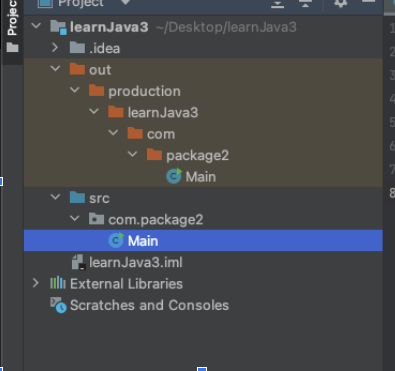

# javaIntroduction

## dependency injection
It is for writing better code and testing
- We do not instantiate a class within the parent class
- Each class is separate and isolated
- So that every class can be mocked

Dependency injection
- inject into the parent class by passing external dependency into the constructor of the parent class
- However, it is troublesome to generate all new instances everywhere, filled to the brim of the heap
- That is why we use singleton - one instance that could be used anywhere e.g. @bean in springboot

```
@Component
public class MOTService{
  private EmailService emailService

//@inject = EmailService emailService = new EmailService()
  @Inject
  public MOTService(EmailService emailService){
    this.emailService = emailService:
  }
}
```

## Java is close to C++ and C#, making it easier to switch to Java or vice versa
Class is just a group of related methods and variable/object
- Class Naming is pascal case
- Method naming is camel case

General structure
```
class Main {
  public void main {
    acccessModifier ReturnType methodName(parameterType parameter){
    }
  }
}
```

## static
Method that belongs to the class.
You cannot get it from the instance of the class


## Com.package is to group related classes
If we have 100 to 1000 classes, it is better to group and organize in package/categories.
So Com.package is a folder under the root folder.

### Java folder structure
`Com.package2.Main`

- Com is a folder
- Package2 is a subfolder
- Main is the class

Although intellij at SRC level collapse the 2 folder into 1 "com.package2"; this is actually nested folder; you can see the out folder layout, which is the byte class code



So that  you could type Java in Main class for execution.

## How Java is excecuted?
Source code.jva => compiler => byte code.class

You can do this compilation in terminal as well:
- Java byte code is platform independant
- Java byte code => JVM java virtual machine => Linux, windows etc.
  - C++ and python has the same way of working
  - that is why it is platform independant
 
In intellij, it also has the same folder structure:
- SRC code folder
- Out code folder - for byte code class file

## Types of Java edition
Standard edition (SE)
- Enterprize edition is built on top of the SE and made to build scaleable enterpize software
  
Micro edition
- Used to build for mobile device

Card edition 
- Used to build for card device

## Convention: every Java program must have the same name as java class
Main.java to class Main
- Every program also must have a main method, might be named differently
  - This main class will wrap every other class under it 
- Because it is execute first

## U can println(num) directly without quotation mark
```
system.out.println(3);
```

# Main Java programming concept

## Java primitive variables types
There are a lot more, below is just the basics
Float, long, double must be ended with f, l, and d
- It seems only float number needs to be ended with f, with higher version of Java
```
        //1 byte 2^8=> 256 combination signed number between -128 and 127
        byte number = 125;

        //2 bytes 2^16
        short numberShort = -23;

        //4 bytes
        int numberInt = 34;

        //8 bytes
        long numbgerlong = 1234;

        //4 byte store fractional number, 6-7 decimal place
        float numberfloat = 0.3f;

        //8 byte, store 15 decimal digits
        double numberDouble = 0.4;

        //1 bit
        boolean married = true;

        //2 byte usually for ascii charadter
        char alphabet = 'B';
```
## the above is primitiave, while non-primitive is upper-cased and come with defined functions in Java
Examples of non-primitive types are Strings, Arrays, Classes, Interface, etc. 

Primitive is defined by Java, but non-primitive is defined by programmer. Non-primitive can be used to call methods to perform certain operation, while primitive cannot.
- String seems to be non-primitive
- So it should have some built in functions

## final variable, similar to const in JS, where you cannot update the value once assigned
```
final int text = 32;
//cannot assign a new value to final var
text = 22;
```

## Type casting - changing varable from 1 type to another; widening is automatic while narrowing needs manual
In Java, there are two types of casting:
Widening Casting (automatically) - converting a smaller type to a larger type size
- byte -> short -> char -> int -> long -> float -> double

Narrowing Casting (manually) - converting a larger type to a smaller size type
- double -> float -> long -> int -> char -> short -> byte

Automatic widening
```
public class Main {
    public static void main(String[] args) {
       int intNum = 9;
       double myDouble = intNum; //automatic casting from int to double

        System.out.println(intNum); //9
        System.out.println(myDouble); //9.0
    }
}
```

Manual narrowing
```
public class Main {
    public static void main(String[] args) {
       double myDouble = 9.78;
       int intNumber = (int) myDouble; //narrowing type needs manual intervention

        System.out.println(myDouble); //9.78
        System.out.println(intNumber); //9
    }
}
```

```
public class Main {
    public static void main(String[] args) {
       int number = (int) (Math.random()*101); //Math.random() will be double, so neeed to manually cast to int
    }
}
```

## Just like JS, Java has ternary operator

```
public class Main {
    public static void main(String[] args) {
       int time = 21;
       String result = time>20? "more than 20": "less than 20";
        System.out.println(result); //more than 20
    }
}
```

## Java array is in curly bracket
```
public class Main {
    public static void main(String[] args) {
        //Unlike JS, java array in curly bracket
       String[] cars = {"Volvo","BMW"};
       for(String i: cars){
           System.out.println(i);
       }
    }
}
```

## Static - method belongs to the main class and not an instance of the main class; void means the method does not have a return value
```
public class Main {
    //a method that returns nothing and belongs to the class itself
    static void myMethod() {
        System.out.println("Executing...");
    }

    //main method
    public static void main(String[] args) {
        myMethod();
    }
}
```

## Java method overloading - same method but for different parameters - rather than defining different functionName doing the same thing,why not use the same func name for readibility and flexibiity

In summary, method overloading helps keep your code clean, organized, and easier to maintain, while also improving readability and flexibility.

Still not seeing the benefits

```
public class Main {
    //two different method names but doing the same function
    static int plusMethodInt (int x, int y){
        return x + y;
    }

    static double plusMethodDouble (double x, double y){
        return x + y;
    }
    
    //method overloading - same method name but different parameters
    static int plusMethod (int x, int y){
        return x +y;
    }

    static double plusMethod (double x, double y){
        return x +y;
    }
    
    //main method
    public static void main(String[] args) {
        System.out.println(plusMethod(3,2));
        System.out.println(plusMethod(3.1,2.3));
    }
}
```
